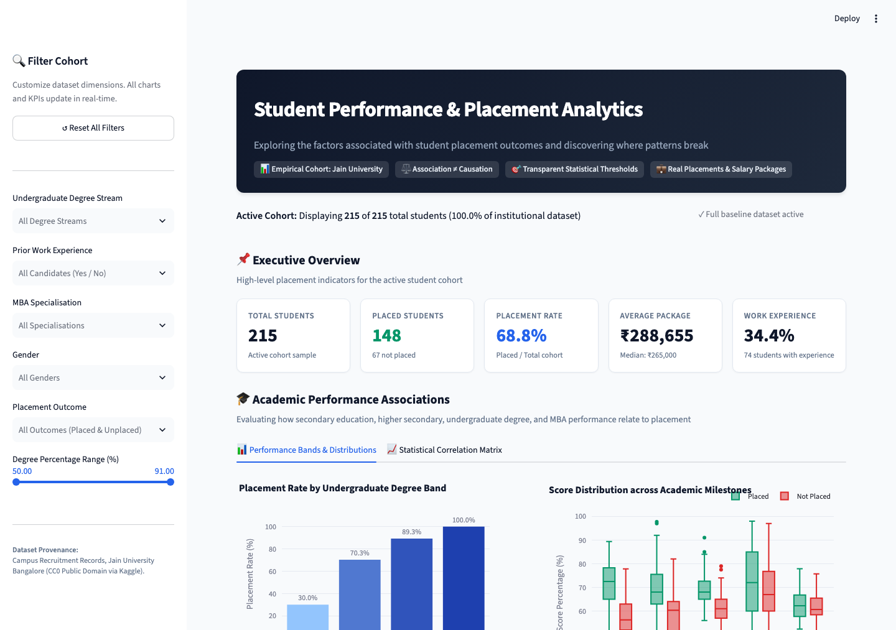

# Student Performance & Placement Analytics Dashboard

[](http://localhost:8501)
[](https://www.python.org/)
[](https://creativecommons.org/publicdomain/zero/1.0/)

> **OpenAI Mission Project:** Turn Data into an Interactive Dashboard  
> **Core Theme:** Investigating factors associated with student placement outcomes and discovering where patterns break.



---

## Project Overview

The **Student Performance & Placement Analytics Dashboard** is an enterprise-grade interactive intelligence tool designed to explore historical institutional recruitment outcomes. By combining descriptive statistics, academic band stratification, multi-dimensional interaction analyses, and transparent pattern-break identification, the application allows academic administrators, career services teams, and student advisors to uncover which factors are associated with placement success—and, crucially, where those associations fail.

---

## Mission

**Mission Goal:** "Turn Data into an Interactive Dashboard"  
**Main Research Question:** *What factors are associated with student placement outcomes?*

### Secondary Research Questions
1. **Academic Performance:** How do secondary (10th/SSC), higher secondary (12th/HSC), undergraduate degree, and MBA performance metrics associate with placement outcomes and salary offers?
2. **Experience & Specialisations:** How are prior work experience, undergraduate discipline, and MBA specialisation associated with recruitment rates?
3. **Pattern Breaks & Exceptions:** Where do the general patterns break? (e.g., Which high-performing students remained unplaced, and which lower-performing students succeeded?)

> **Important Epistemological Note:** This dashboard strictly analyzes **observational statistical associations**, not causation. Having prior experience or high degree marks is associated with higher placement rates in this dataset, but does not prove a direct causal relationship.

---

## Dataset

- **Source:** Campus Recruitment Records, Jain University Bangalore (published by Ben Roshan on Kaggle)
- **Source URL:** [Kaggle - Factors Affecting Campus Placement](https://www.kaggle.com/datasets/benroshan/factors-affecting-campus-placement)
- **Direct Raw Data Source:** [Student-Placement-Prediction (GitHub)](https://raw.githubusercontent.com/gouravkhator/Student-Placement-Prediction/master/Placement_Data_Full_Class.csv)
- **License:** **CC0: Public Domain** (Open accessibility for educational and commercial analysis)
- **Retrieval Date:** September 27, 2026
- **Status:** **Real-world collected institutional data** (not synthetic, not simulated)
- **Cohort Size:** 215 student records across 15 variables
- **Target Variable:** `status` (`Placed` [148] vs `Not Placed` [67])

### Variables Used

| Variable | Type | Description |
|:---|:---|:---|
| `student_id` (`sl_no`) | Integer | Unique anonymized candidate identifier (1 to 215) |
| `gender` | Categorical | Candidate gender (`Male` [139], `Female` [76]) |
| `ssc_percentage` (`ssc_p`) | Float | 10th grade Secondary School percentage (40.89% – 89.40%) |
| `ssc_board` (`ssc_b`) | Categorical | 10th grade examination board (`Central`, `Others`) |
| `hsc_percentage` (`hsc_p`) | Float | 12th grade Higher Secondary percentage (37.00% – 97.70%) |
| `hsc_board` (`hsc_b`) | Categorical | 12th grade examination board (`Others`, `Central`) |
| `hsc_stream` (`hsc_s`) | Categorical | Higher secondary discipline (`Commerce`, `Science`, `Arts`) |
| `degree_percentage` (`degree_p`) | Float | Undergraduate degree percentage (50.00% – 91.00%) |
| `degree_type` (`degree_t`) | Categorical | Undergraduate degree stream (`Comm&Mgmt`, `Sci&Tech`, `Others`) |
| `work_experience` (`workex`) | Categorical | Prior formal work experience (`Yes` [74], `No` [141]) |
| `employability_score` (`etest_p`) | Float | College-administered employability test score (50.00% – 98.00%) |
| `mba_specialisation` (`specialisation`) | Categorical | MBA program specialisation (`Mkt&Fin` [120], `Mkt&HR` [95]) |
| `mba_percentage` (`mba_p`) | Float | MBA course percentage (51.21% – 77.89%) |
| `placement_status` (`status`) | Categorical | Final recruitment outcome (`Placed` [148], `Not Placed` [67]) |
| `salary` | Float | Annual compensation in INR for placed candidates (₹200,000 – ₹940,000) |

---

## Data Preparation & Cleaning

1. **Schema Standardization:** Standardized raw shorthand column names (`sl_no`, `ssc_p`, `degree_t`, `workex`) into human-readable snake_case identifiers.
2. **Missing Value Integrity:** Confirmed 67 missing salary values correspond 100% to unplaced students. Retained legitimate missing values for unplaced records rather than corrupting distributions with zeros.
3. **Zero Duplication:** Confirmed 0 duplicate records and 100% unique primary keys (`student_id`).
4. **Range & Sanity Verification:** Validated that all academic percentages fall between 0% and 100% with no impossible values.
5. **Stratification & Performance Bands:** Created standard academic tiers (`<60%`, `60–70%`, `70–80%`, `80%+`) to reveal non-linear step changes in recruitment rates.
6. **Data Output:** Saved reproducible pipeline output as `data/cleaned_student_placement.csv`.

---

## Dashboard Features

- **Interactive Cohort Filters (Sidebar):**
  - Undergraduate degree stream multiselect
  - Work experience selector (`Yes` / `No`)
  - MBA specialisation selector (`Mkt&Fin` / `Mkt&HR`)
  - Gender filter
  - Placement outcome filter
  - Interactive degree percentage range slider
  - **Reset All Filters** button with automatic cohort recalculation
- **Section A — Executive Overview:** Real-time KPI cards displaying Total Students, Placed Students, Cohort Placement Rate, Average Package (with median), and Work Experience participation.
- **Section B — Academic Performance:**
  - Ordered degree band bar chart with tooltips: `Band | Total Students | Placed | Placement Rate`
  - Multi-milestone box plot comparing Placed vs. Not Placed across SSC, HSC, Degree, Employability, and MBA scores.
  - Interactive point-biserial correlation matrix with mean differences.
- **Section C — Experience & Specialisation:**
  - Work experience placement rate comparison bar chart.
  - Salary package box plot distribution for placed students stratified by work experience.
- **Section D — Subgroup Breakdowns:**
  - 2D Interaction analysis: Academic Tier × Work Experience on placement rates.
  - Specialisation × Degree Discipline segmented placement rates.
- **Section E — Pattern Breaks & Exception Deep-Dive:**
  - High Academic + Unplaced alert card and record inspector.
  - Lower Academic + Placed success card and record inspector.
  - Prior Experience + Unplaced anomaly card and record inspector.
- **Section F — Evidence-Based Key Findings:** Dynamically generated finding-evidence-interpretation cards.

---

## Key Analysis & Findings

| Analytical Dimension | Placed Cohort | Unplaced Cohort | Observed Association |
|:---|:---|:---|:---|
| **Secondary Education (10th/SSC)** | Mean: 71.7% | Mean: 57.5% | Strong positive association (\(r = 0.608\)) |
| **Higher Secondary (12th/HSC)** | Mean: 69.9% | Mean: 58.4% | Strong positive association (\(r = 0.491\)) |
| **Undergraduate Degree %** | Mean: 68.7% | Mean: 61.1% | Moderate-strong positive association (\(r = 0.480\)) |
| **Prior Work Experience** | 86.5% placed (64/74) | 59.6% placed (84/141) | +26.9 percentage point lift in placement rate |
| **MBA Specialisation** | Mkt&Fin: 79.2% placed | Mkt&HR: 55.8% placed | +23.4 percentage point higher placement rate for Finance |
| **Employability Score (etest_p)** | Mean: 73.2% | Mean: 69.6% | Weak linear correlation (\(r = 0.128\)) |
| **MBA Academic % (mba_p)** | Mean: 62.6% | Mean: 61.6% | Very weak linear correlation (\(r = 0.077\)) |

---

## Pattern Break / Exception Analysis

The dashboard explicitly isolates observations that contradict simple linear assumptions:

1. **High Academic + Unplaced (12 Students):**
   - **Threshold:** Undergraduate Degree percentage \(\ge 72.0\%\) (Top Quartile).
   - **Finding:** 12 students in the top quartile of degree scores were not placed. Notably, **11 of these 12 students had zero prior work experience**, indicating that high grades alone were insufficient to secure placement during campus hiring.
2. **Lower Academic + Placed (53 Students):**
   - **Threshold:** Undergraduate Degree percentage \(< 66.0\%\) (Below Cohort Median).
   - **Finding:** 53 students scoring below the median degree score secured placement offers. Prior work experience buffered lower academics: for students with below-median degree scores, those with work experience achieved a **73.3% placement rate** compared to just **34.2%** for peers without experience.
3. **Experience + Unplaced (10 Students):**
   - **Finding:** 10 candidates with prior work experience did not receive offers, 7 of whom were enrolled in Marketing & HR and 8 of whom held below-average 10th/12th school records.

---

## Technology Stack

- **Application Framework:** Streamlit (>= 1.35.0)
- **Data Manipulation:** Pandas (>= 2.0.0), NumPy (>= 1.26.0)
- **Interactive Visualization:** Plotly Express & Plotly Graph Objects (>= 5.20.0)
- **Language & Runtime:** Python 3.12

---

## Project Structure

```text
1ST-MISSION/
├── app.py                     # Main interactive Streamlit application
├── requirements.txt           # Minimal production dependencies
├── runtime.txt                # Deployment environment specification (python-3.12)
├── .gitignore                 # Exclusion configuration for venv, caches, and OS files
├── README.md                  # Comprehensive project documentation
├── SUBMISSION.md              # Official Handshake submission content (<500 chars)
│
├── data/
│   ├── student_placement.csv           # Original authentic institutional dataset
│   ├── cleaned_student_placement.csv   # Normalized & enriched dataset
│   └── README.md                       # Complete provenance, schema & audit audit
│
├── src/
│   ├── __init__.py            # Package initializer
│   ├── data_loader.py         # Cached data loading and path resolution
│   ├── data_cleaning.py       # Data validation, normalization & feature banding
│   ├── analysis.py            # Mathematical KPI, band, breakdown & exception engine
│   └── insights.py            # Evidence-based non-causal insight generator
│
├── tests/
│   └── test_dashboard.py      # Automated unittest suite (7 unit tests, 100% pass)
│
├── scripts/
│   └── capture_screenshot.py  # Headless Chrome CDP automated visual capture
│
├── assets/
│   └── dashboard_preview.png  # High-fidelity dashboard screenshot for submission
│
└── .streamlit/
    ├── config.toml            # Modern clean theme and server settings
    └── credentials.toml       # Headless non-interactive credential setup
```

---

## Local Setup & Reproduction

### Prerequisites
- Python 3.11 or Python 3.12
- Git

### 1. Clone & Navigate to Project Directory
```bash
git clone <repository-url>
cd "1ST-MISSION"
```

### 2. Set Up Virtual Environment

**macOS / Linux:**
```bash
python3 -m venv .venv
source .venv/bin/activate
```

**Windows:**
```powershell
python -m venv .venv
.venv\Scripts\activate
```

### 3. Install Dependencies
```bash
pip install -r requirements.txt
```

### 4. Run Automated Test Suite
```bash
python -m unittest tests/test_dashboard.py
```

### 5. Launch the Dashboard
```bash
streamlit run app.py
```
Open [http://localhost:8501](http://localhost:8501) in your browser.

---

## Deployment to Streamlit Community Cloud

This project is configured for one-click deployment:
1. Push this repository to GitHub.
2. Navigate to [share.streamlit.io](https://share.streamlit.io).
3. Connect your GitHub account and select this repository.
4. Specify:
   - **Main file path:** `app.py`
   - **Branch:** `main` (or `master`)
5. Click **Deploy**. All paths are resolved dynamically via `pathlib`, dependencies are declared in `requirements.txt`, and runtime is pinned in `runtime.txt`.

---

## Limitations

- **Observational Nature:** All findings indicate observational associations and should never be interpreted as causal relationships.
- **Single-Institution Cohort:** Data was collected from a single management and technical institution in Bangalore; patterns may differ across other institutions, geographies, or academic disciplines.
- **Cycle Timing:** Placement demand reflects economic hiring conditions during the collection year.
- **Unmeasured Confounders:** Qualitative factors such as communication skills, technical interview readiness, portfolio projects, and recruiter preferences are not fully captured by numeric academic metrics.

---

## Author

- **Author:** YRSevra
- **Email:** sevrayash45@gmail.com
- **Project:** OpenAI Mission — Turn Data into an Interactive Dashboard
